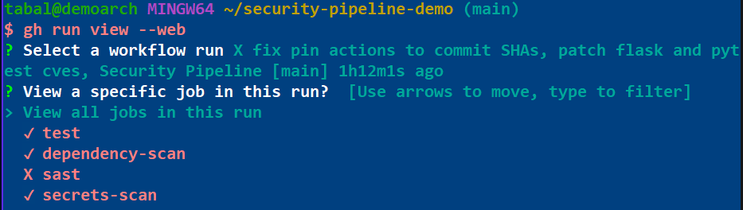
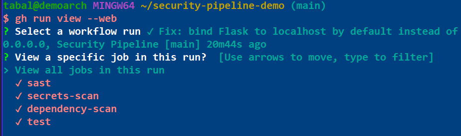

Both packages were pinned at versions that were current when written and had
published advisories by the time the pipeline ran. No amount of care at the time
of writing prevents this — pinned versions rot, and only a scanner running
continuously catches the moment they do.

**Fix:** upgraded to the patched versions and re-ran the test suite to confirm
the upgrade did not break the application. Patching without verifying trades a
vulnerability for an outage.

### 3. Flask bound to all network interfaces (Semgrep)

**Rule:** `python.flask.security.audit.app-run-param-config.avoid_app_run_with_bad_host`

```python
app.run(debug=False, host="0.0.0.0", port=5000)
```

`0.0.0.0` binds to every network interface, exposing the development server to
the local network rather than just the loopback interface.

**Fix:** default to `127.0.0.1`, with an explicit environment variable required
to widen the binding. The insecure option remains available for the cases that
genuinely need it, but it now has to be chosen deliberately.

```python
host = os.environ.get("FLASK_HOST", "127.0.0.1")
app.run(debug=False, host=host, port=5000)
```

---

## Pipeline history

The commit history shows the full detect-fix-verify cycle:

| Commit | Result |
|---|---|
| Initial commit: Flask app + starter CI | Pass — baseline with tests and Gitleaks only |
| Add pip-audit and Semgrep | **Fail** — 8 SAST findings, 3 CVEs |
| Pin actions to SHAs, patch CVEs | **Fail** — down to 1 finding |
| Bind Flask to localhost | Pass — all four jobs green |





---

## Tool choices

**Semgrep over CodeQL.** CodeQL has deeper dataflow analysis and is the stronger
tool for finding complex vulnerabilities. Semgrep was chosen here for faster
feedback, simpler configuration, and rule packs that are readable as plain YAML
— which matters more for a project whose purpose is to demonstrate the pipeline
rather than to secure a large codebase. On a production Python service I would
run both.

**pip-audit over Dependabot alone.** Dependabot opens pull requests but does not
fail a build. pip-audit runs as a gate, so a vulnerable dependency cannot merge
unnoticed. The two are complementary: Dependabot for the fix, pip-audit for the
enforcement.

**Gitleaks over TruffleHog.** Both are capable. Gitleaks was chosen for its
simpler GitHub Actions integration and lower configuration overhead at this
scale.

---

## Known limitations

Worth being explicit about, since a pipeline that appears to have no downsides
usually just has undocumented ones:

- **False positives are real.** SAST tools flag patterns, not exploits. Some
  findings will be unreachable code paths. Managing that triage burden — rather
  than suppressing rules wholesale — is the actual work.
- **pip-audit fails on any published CVE**, including ones in code paths the
  application never executes. This is the correct default but generates noise.
- **SHA pinning has a maintenance cost.** Pins do not update themselves;
  Dependabot is what keeps this sustainable.
- **No runtime testing.** Everything here is static analysis. DAST and container
  scanning would cover different ground.

---

## Running locally

```bash
python -m venv .venv
source .venv/bin/activate      # Windows: .venv\Scripts\activate
pip install -r requirements.txt
pytest -v
python app.py
```

The API exposes `/`, `/health`, and `/users/<username>`.

---

## Next steps

- [ ] Branch protection requiring all four checks to pass before merge
- [ ] Terraform component (S3 bucket + IAM role) scanned with Checkov, applying
      the same detect-fix-verify cycle to infrastructure as code
- [ ] Dependabot configuration for automated dependency and action updates
- [ ] SARIF upload so findings appear in the GitHub Security tab rather than
      only in workflow logs